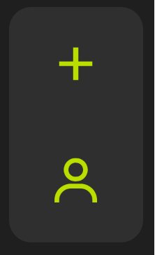
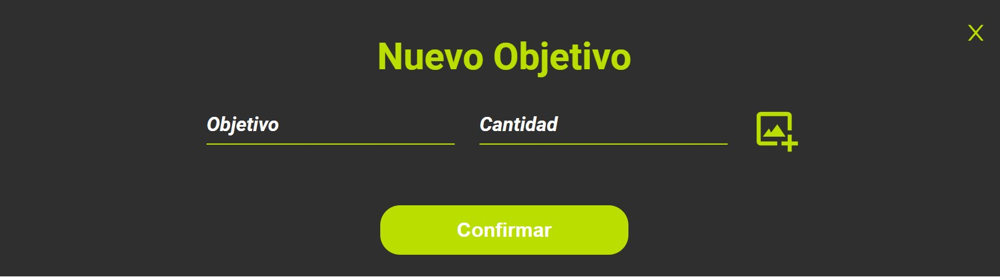
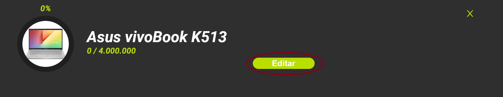
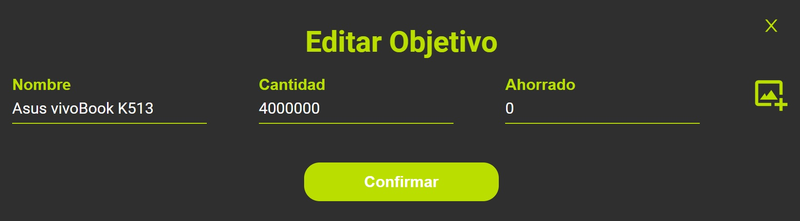
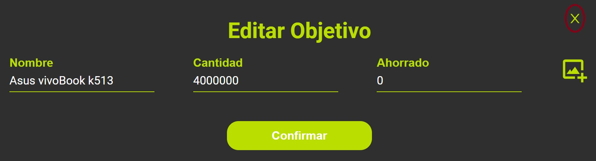

# Gestor de ahorros con React

Gestor de ahorro creado utilizando React, Node.JS y MongoDB

### Creacion del boceto del diseño

Para la creacion del boceto que se utilizaria como referencia para la creacion de la pagina web, se utilizo Figma

>[!NOTE] 
> Puedes acceder al boceto con el siguiente link:
>[click aqui](https://www.figma.com/file/oMhBibkLbX1TzGgETWfRlj/Ahorros?type=design&node-id=0%3A1&mode=design&t=ppkmoX07jPD7s5Jf-1)

### Funcion de la pagina

La pagina tiene como funcion organizar nuestros objetivos economicos, con un titulo, la cantidad de dinero💸 que se necesita ahorrar y la cantidad que se tiene ahorrada, tambien incluye una imagen a modo de ilustracion o representacion del objetivo

>[!NOTE] 
>La pagina permite añadir una imagen personalizada, pero en caso de que no se agrege, se añadira una predeterminada:

### Estado de la pagina

Acatualmente me encuentro trabajando en la funcionalidad de inicio de sesión, corrigiendo errores y el carrucel donde se mostrara informacion de objetivos como, objetivos creados recientemente, objetivos que han sido completados, mas cercanos o mas lejanos a completar, etc. 

### Creacion de la pagina

Para la cracion de la pagia se creó un contexto en el cual se encentran todas los funciones que nos permitiran crear objetivos, editarlos, etc.

#### Creacion de un objetivo

para la creacion de un objetivo de pulsa en el signo mas (+) que que encuentra en la parte izquierda de la pagina

Luego, se rellena el formulario que se abrirá en una ventana modal

y por ultimo se preciona en confirmar 

#### Editar un objetivo 

Para la edición se identifica el objetivo que se editará, y se pulsa editar

>[!NOTE] 
>El formulario esta rellenado por defecto con la informacion que tenia el objetivo antes de ser editado

>[!NOTE] 
>Puedes cancelar la edicion precionando en la equis(x) en la parte superior derecha del modal

Despues de editar los campos necesarios se preciona confirmar

#### Eliminar un objetivo